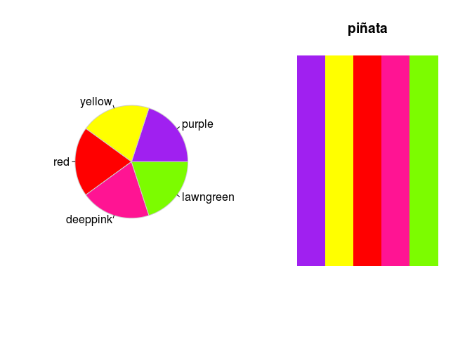
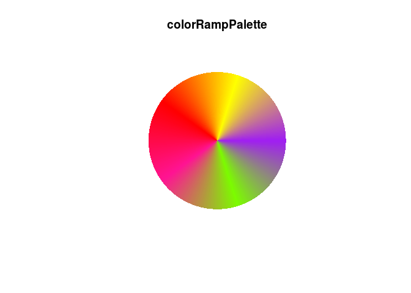
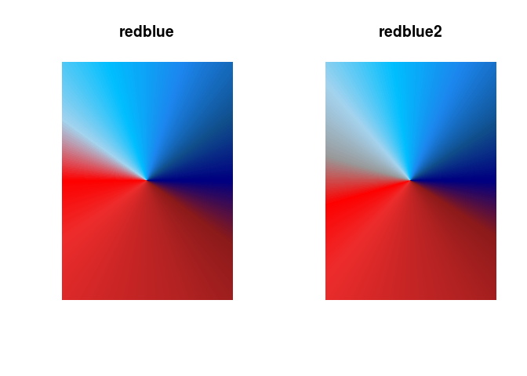
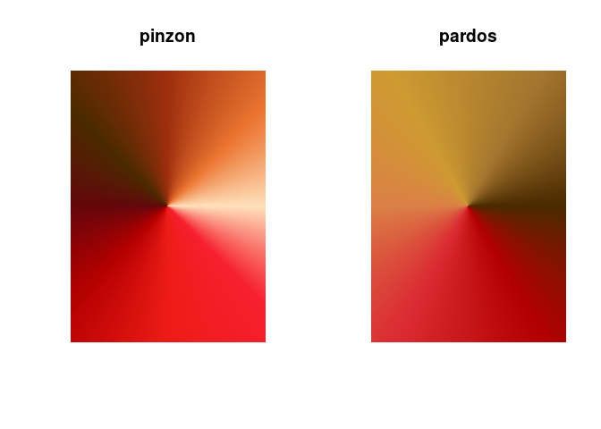
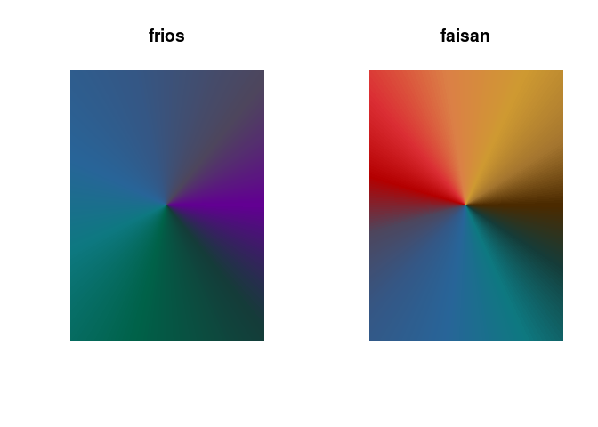
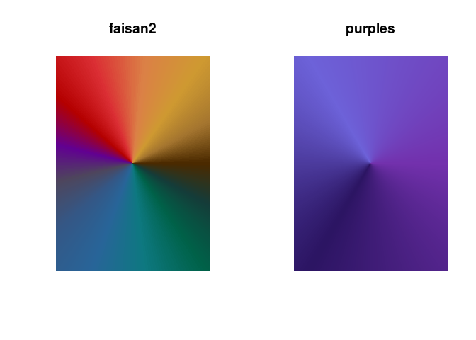
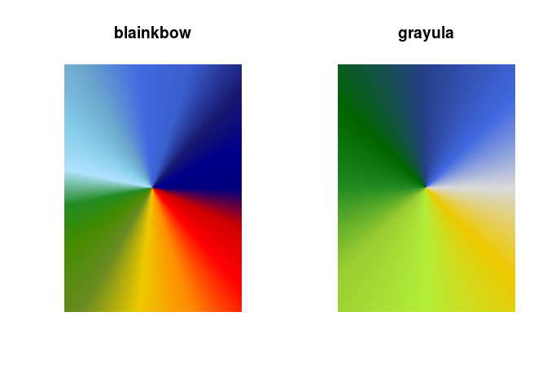
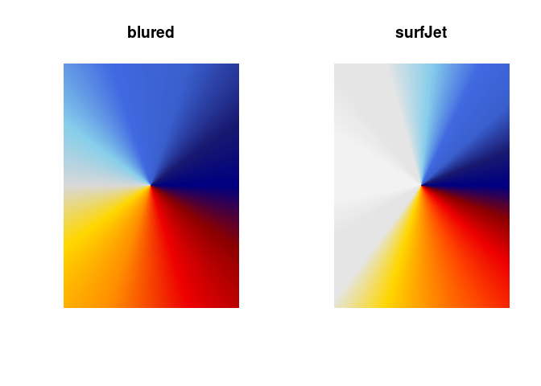
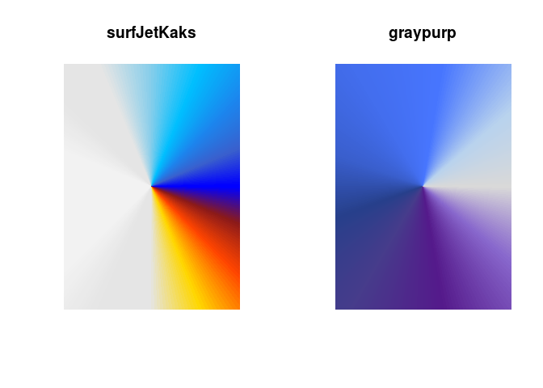
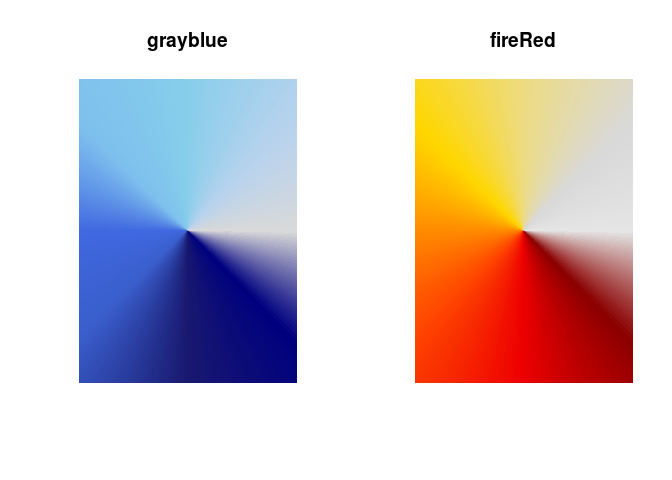

-   [Repository content:](#repository-content)
-   [Colors and Data Visualization](#colors-and-data-visualization)
    -   [Color Selection](#color-selection)
    -   [Color Alpha](#color-alpha)
    -   [Color Interpolation](#color-interpolation)
    -   [[Color Optimization](https://github.com/rcruces/R-plots/blob/master/R-heatmap/README.md)](#color-optimization)
    -   [Color palettes from `R` to `matlab`](#color-palettes-from-r-to-matlab)
    -   [Custom Color Palettes](#custom-color-palettes)
    -   [Custom Color Palettes Interpolated](#custom-color-palettes-interpolated)

Repository content:
===================

1.  `README.md`
2.  `Rcolor.pdf` - Here you will find the names of a wide variety of colors in R.
3.  `colormaps_functions.R` FUnctions for customizing and visualizing color maps.

Colors and Data Visualization
=============================

Data visualization involves the esquematization of information and its representation as a visual object. The main goal is to communicate information clearly.
Color palettes are a very useful tool for data visualization, its proper utilization impacts in the quality of the visual information we want to transmit.

R has a wide variety of colors, in the document [Rcolor.pdf]() you can find the name of plenty of common colors. The colors can be called with the hexadecimal code or with a its name. For example the color `white` can be represented as:

> "\#FFFFFF" or "white"

NOTE: The colors are characters in R!!

Color Selection
---------------

First of all you might want to choose some nice colors that you like based on [color theory](https://en.wikipedia.org/wiki/Color_theory), [color harmony](https://en.wikipedia.org/wiki/Harmony_(color)) or in your favorite colors.

Here I picked my favorite colors and I plotted them in a pie chart:

``` r
# Vector of colors
piñata <- c("purple","yellow","red","deeppink","lawngreen")

# Function - Color Palette Visualization
color.test <- function(color.vec) {
  n=length(color.vec)
  barplot(rep(1,n),space = 0,border = NA, axes = F, col = color.vec, main=deparse(substitute(color.vec)))
}

# Outline of 1 row, 2 columns
par(mfrow=c(1,2))
# Pie representation of our FIVE colors
pie(rep(1,5),col = piñata, labels = piñata,border = "gray80")

# Plot the Color Vector
color.test(piñata)
```



Color Alpha
-----------

The transparency of the color can be also modified. Here I use the scrip `addTrans` from the package qgraph.

``` r
# This function belongs to the package qgraph
addTrans <- function(color,trans)
{
  # This function adds transparancy to a color.
  # Define transparancy with an integer between 0 and 255
  # 0 being fully transparant and 255 being fully visable
  # Works with either color and trans a vector of equal length,
  # or one of the two of length 1.
  
  if (length(color)!=length(trans)&!any(c(length(color),length(trans))==1)) stop("Vector lengths not correct")
  if (length(color)==1 & length(trans)>1) color <- rep(color,length(trans))
  if (length(trans)==1 & length(color)>1) trans <- rep(trans,length(color))
  
  num2hex <- function(x)
  {
    hex <- unlist(strsplit("0123456789ABCDEF",split=""))
    return(paste(hex[(x-x%%16)/16+1],hex[x%%16+1],sep=""))
  }
  rgb <- rbind(col2rgb(color),trans)
  res <- paste("#",apply(apply(rgb,2,num2hex),2,paste,collapse=""),sep="")
  return(res)
}

# Different transparencies
piñata.200 <- addTrans(piñata,200)
piñata.100 <- addTrans(piñata,100)
piñata.50 <- addTrans(piñata,50)
piñata.25 <- addTrans(piñata,25)

# Plot each color vector
par(mfrow=c(1,5))
color.test(piñata)
color.test(piñata.200)
color.test(piñata.100)
color.test(piñata.50)
color.test(piñata.25)
```


Color Interpolation
-------------------

The function called `colorRampPalette` creates a function that interpolates a vector of given colors. This is very useful to create our own color palettes. I create an interpolation for my vector of colors `piñata` of a 256 colors length.

``` r
# Vector of colors
# NOTE: Purple is repeated at the begining and at the end for better visualization of pie chart
piñata <- c("purple","yellow","red","deeppink","lawngreen","purple")

# Function with the color vector
color.pal <- colorRampPalette(piñata)

# Number of color for interpolation
N <- 256

# Pie plot
pie(rep(1,N),col = color.pal(N), labels = NA,border = NA,main = "colorRampPalette")
```



[Color Optimization](https://github.com/rcruces/R-plots/blob/master/R-heatmap/README.md)
----------------------------------------------------------------------------------------

If you want to improve the visualization of you data is a good idea to optimize the color palette based on the distribution of your data (if it's normally distributed). An example of color optimization on a heatmap visualization can be found [here](https://github.com/rcruces/R-plots/blob/master/R-heatmap/README.md).


Color palettes from `R` to `matlab`
-----------------------------------

Sometimes is much faster to create a custom palette in R and export it to R. It is possible to do it with two functions one for exporting the color map from `R` to a `csv` file and the other for reading it on `matlab`.

### Export a Color palette from R

``` r
# Function for saving the colormaps as csv for matlab use
save.colmap <- function(color.vec,outfile){
  # color.vec - Vector of colors
  # outfile - The path and the name of the csv 
  Colmap <- colorRampPalette(color.vec)
  Colmap<-t(col2rgb(Colmap(256)))
  Colmap<-Colmap/256
  write.csv(Colmap,file=outfile,row.names=FALSE,quote = FALSE) }
```

### Import color palette in csv for matlab

``` matlab
function [colPal] = loadColor(Path)
  %% Loads my cool Colormap
        for readcsv = 1
                fid = fopen(Path);
                C   = textscan(fid,'%n%n%n','Delimiter',',','headerLines',1,'CollectOutput',1);
                fclose(fid);
                colPal=zeros(256, 3);
                % These are the variables of interest 
                % -- 
                for i=1:3
                        colPal(:,i) = C{1}(:,i);
                end
        end
```

Custom Color Palettes
---------------------


Custom Color Palettes Interpolated
----------------------------------


