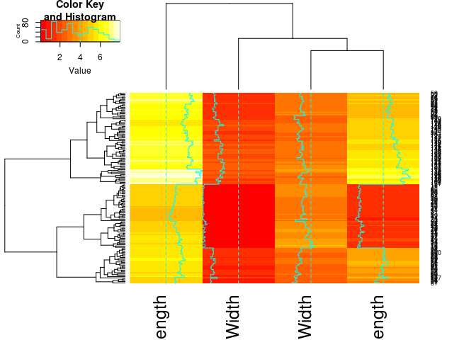
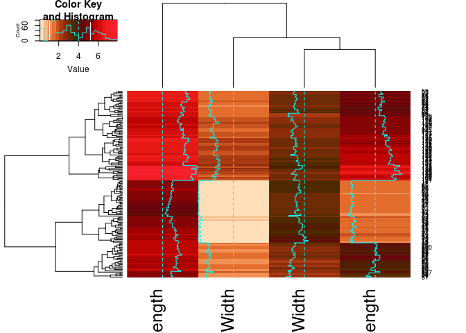
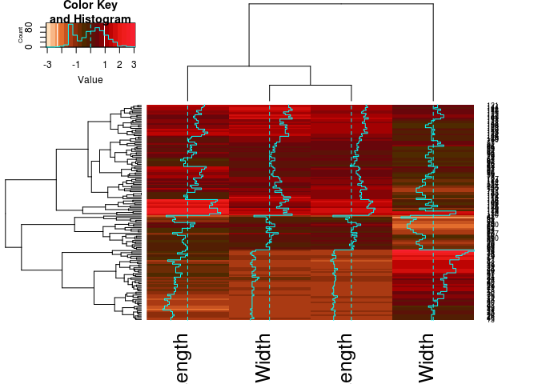
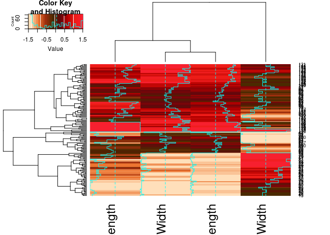
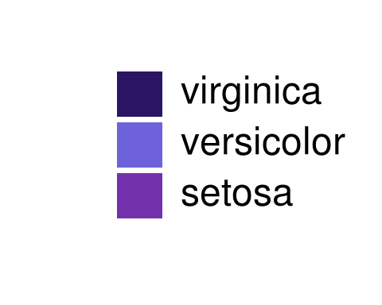
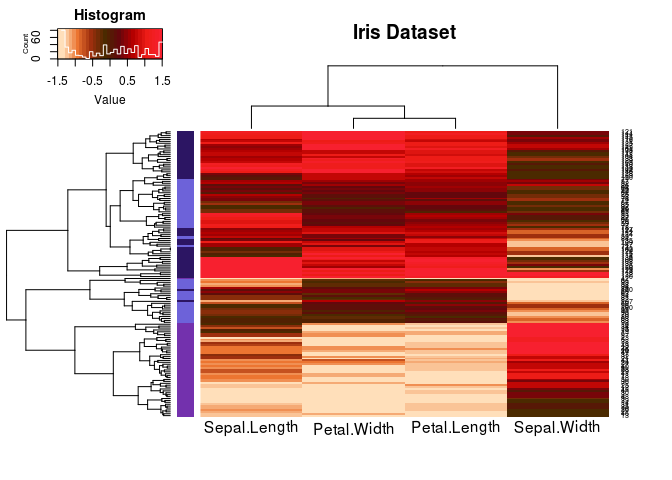
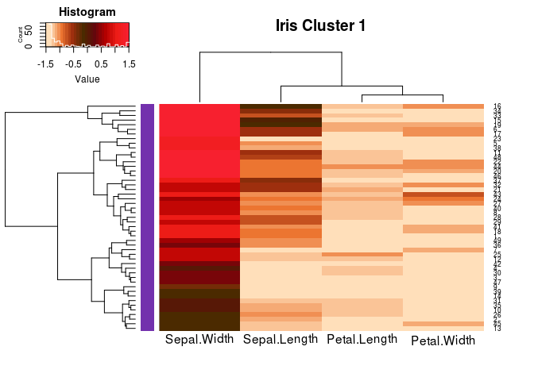
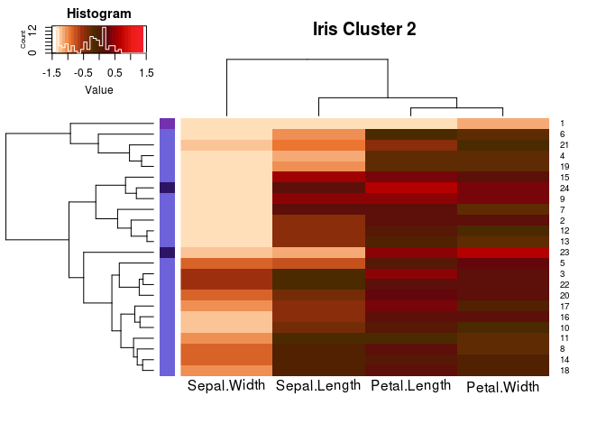
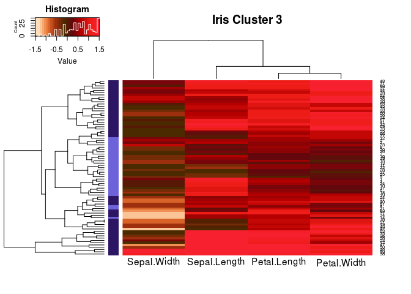
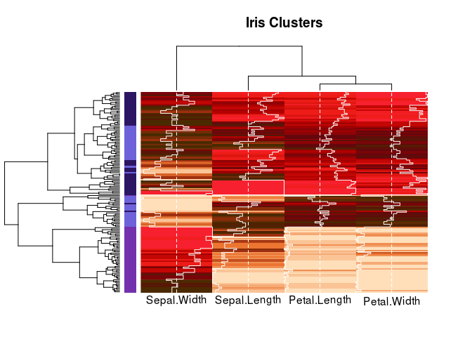

Heatmap Contents
================
-   [Heatmap Definition](#heatmap-definition)
    -   [Description of the files](#description-of-the-files)
-   [Iris Dataset](#iris-dataset)
    -   [Requirements and Data Processing](#requirements-and-data-processing)
-   [Heatmap Customization](#heatmap-customization)
    -   [Color map](#color-map)
    -   [Data Scaling](#data-scaling)
    -   [Colormap Optimization](#colormap-optimization)
    -   [More Arguments](#more-arguments)
    -   [Heatmap per Cluster](#heatmap-per-cluster)

Description of the files
------------------------

Inside this Directory you will find:
1. `README.md`  github markdown format
1. `README.Rmd` R-markdown document with the example.
1. `heatmap\_code.R` Only the code without explanations.

Heatmap Definition
==================

A heatmap is a matrix of values represented with colors. If you use it along a clustering method such as *Hierarchical agglomerative clustering*, heatmap are a very good approach to visualize the diferences between groups.

In this example we will use the [*Iris* flower dataset](https://en.wikipedia.org/wiki/Iris_flower_data_set), and we will create a custom color palette to optimize the visualization. Finally we'll explore diferent ploting of the data.

Iris Dataset
============

The [*Iris* flower dataset](https://en.wikipedia.org/wiki/Iris_flower_data_set) contains 5 variables and 150 observations. The data consists of 50 samples of three species of Iris:

-   *I. Setosa*

-   *I. Versicolor*

-   *I. Virginica*

The columns 1 to 4 have the morphological characteristics of each Iris observation:
1. *Sepal Length*

1.  *Sepal Width*

2.  *Petal Length*

3.  *Petal Width*

The fifth column corresponds to the name of species. On the next figure you can see what are these features: 

Requirements and Data Processing
--------------------------------

1.  We have to install the library `gplots` in case we don't have it yet.
    `install.packages(gplots)`

2.  Now let's upload the library `gplots`, then slice all the observations from column 1 to 4 to a matrix object.

``` r
# Uploads the library
library(gplots)

# Iris data frame should be transformed to a matrix 
iris.mtx <- as.matrix(iris[,1:4])

# Heatmap with the default characteristics
heatmap.2(iris.mtx)
```



Heatmap Customization
=====================

Color map
---------

First let's change the default colormap for our own. For more information about creating Custom R colormaps [click here]().

``` r
# Vector of custom colors
pinzon <- c("#ffdfbaff","#ec7531ff","#9e2f0eff","#4b2a00ff","#64070cff","#b40000ff","#ed1c17ff","#f7202fff")

# Funtion that interpolates the vector of colors
pinzon.Ramp <- colorRampPalette(pinzon)

# Heatmap with our custom colormap
heatmap.2(iris.mtx, col=pinzon.Ramp(20))
```



Data Scaling
------------

The latter heatmap looks very nice, however when differents variables are plotted together, each variable should be standadized (or scaled). This mean that each column must have a mean value of 0 and a standard deviation of 1.
Standardized variables are most frequently used to compare an observation to a standard normal deviate, and they help to compare among different variables that describe an observation in a given sample or between groups.

``` r
# Standardizing the variables
iris.scaled <- scale(iris.mtx)

# Heatmap with our custom colormap & Standarized variables 
heatmap.2(iris.scaled, col=pinzon.Ramp(20))
```



Colormap Optimization
---------------------

When we scaled the data, we realized that the color distribution may not be the optimal for visualization. To create an optimal distribution of colors according to our data an extra step is needed. We'll create a function that optimize the color distribution based on the sample distribution.

``` r
# Function that optimizes the color distribution
optim.color <- function(Data,Colors) {
  #       Data: Is the matrix of data to plot
  #       Colors: Vector of colors we want to use
  # 
  mtx <- as.matrix(Data)
  # Following code limits the lowest and highest color to 5%, and 95% of your range, respectively
  quantile.range <- quantile(mtx, probs = seq(0, 1, 0.01))
  palette.breaks <- seq(quantile.range["5%"], quantile.range["95%"], 0.1)
  # Find optimal divergent color palette (or set own)
  color.function <- colorRampPalette(Colors)
  color.palette  <- color.function(length(palette.breaks) - 1)
  # Returns a list with the color map and the optimal number of color breaks
  return(list(color.palette=as.vector(color.palette),palette.breaks=as.vector(palette.breaks)))
}

# We apply our color optimization function to the scaled matrix
col.map <- optim.color(iris.scaled,pinzon)

# Heatmap with Data scaled and custom colors optimized
heatmap.2(iris.scaled, col=col.map$color.palette, breaks = col.map$palette.breaks)
```



More Arguments
--------------

Here we'll add a color code per group in the rows, and some modifications to the heatmap output. Group color code is the next: 

``` r
# More Customizations
heatmap.2(iris.scaled,                 # Data matrix
          main = "Iris Dataset",       # Main Title
          density.info="histogram",    # should be one of “histogram”, “density”, “none”
          trace="none",                # Draw the trace over "column", "row" or "both"
          tracecol="white",            # Color of the Trace
          key.title = "Histogram",     # Title of the color key
          dendrogram='both',           # Draw dendrogram: "column", "row", "both"
          Rowv=TRUE,
          Colv=TRUE,
          RowSideColors = col.group,        # Group color
          col    = col.map$color.palette,   # Colormap
          breaks = col.map$palette.breaks,  # Color breaks
          labCol = colnames(iris.scaled),   # Column labels
          srtCol=1,                         # Column names rotation 1=0°,0=90°
          cexCol=1.5,                       # Column names font size
          adjCol = 0.5                      # Column names position 0.5=centered
)
```



Heatmap per Cluster
-------------------

Here we will use the [*Ward Method*](https://en.wikipedia.org/wiki/Hierarchical_clustering) for hierarchical clustering of the rows, and we'll plot each cluster as a heatmap individually. In this example We will define the cluster cut as k=3.

``` r
# Transpose the distance matrix and clusters the columns
hc.cols <- hclust(dist(t(iris.scaled)),method = "ward.D2")

# Clusterization of the rows
hc.rows <- hclust(dist(iris.scaled))

# Draw a heatmap per each cluster
# we define three cluster K=3
iris.cluster <- data.frame()
col.cluster <- c()
for (K in 1:3) {
  # Conditional for cluster selection
  rows.cluster <- cutree(hc.rows,k=3)==K
  # New cluster matrix
  iris.cluster <- rbind(iris.scaled[rows.cluster,],iris.cluster)
  # New cluster group color
  col.cluster <- c(col.group[rows.cluster],col.cluster)
  
  heatmap.2(iris.scaled[rows.cluster,], 
            main = paste("Iris Cluster",K), 
            density.info="histogram",
            trace="none",
            tracecol="white",
            key.title = "Histogram",
            dendrogram='both',
            Rowv=TRUE,
            Colv=as.dendrogram(hc.cols),
            RowSideColors = col.group[rows.cluster],
            col=col.map$color.palette, 
            breaks = col.map$palette.breaks,
            srtCol=1, cexCol=1.5, adjCol = 0.5)
}
```



``` r
# Cluster Heatmap 
heatmap.2(as.matrix(iris.cluster), 
            main = "Iris Clusters", 
            density.info="histogram",
            key = FALSE,           # Removes the color Key
            trace="column",
            tracecol="white",
            dendrogram='both',
            labRow = NA,           # Removes the row labels
            Rowv=TRUE,
            Colv=as.dendrogram(hc.cols),
            RowSideColors = col.cluster,
            col=col.map$color.palette, 
            breaks = col.map$palette.breaks,
            srtCol=1, cexCol=1.5, adjCol = 0.5)
```


