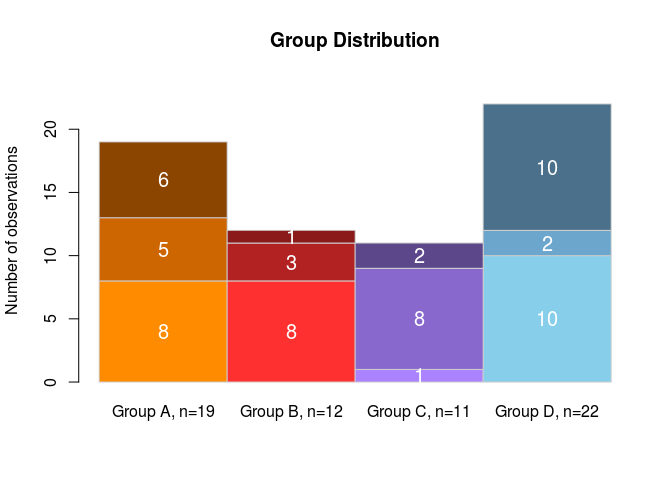
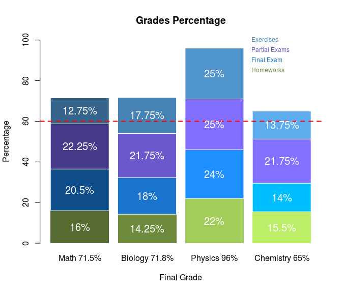

-   [Stacked barplot](#stacked-barplot)
    -   [Stacked plot: Group distribution](#stacked-plot-group-distribution)
    -   [Stacked plot: Grades](#stacked-plot-grades)

Stacked barplot
===============

This graphic representations allows to display different groups or variables of the same observation on top of each other.
We'll explore two examples of stacked plots use, the numeric distribution of groups and as percentages.

Stacked plot: Group distribution
--------------------------------

Here we'll plot the number of observations in four groups, and three possible conditions:
1. Excluded
2. Included
3. Incomplete

> NOTE: Border color, color, and space could be different per stack and per bar.

``` r
# Matrix of 3x4, 3 conditions, 4 groups. Filled with random values
groups <- matrix(sample(1:10, 3*4, replace=T), 3, 4, byrow = TRUE)

# Names of the rows, corresponds to the conditions
rownames(groups) <- c("Included", "Excluded", "Incompleted")

# Names of the columns, corresponds to the groups
colnames(groups) <- c("Group A", "Group B", "Group C", "Group D")

# Barplot with the first row
labs<- paste(colnames(groups), ", n=", apply(groups,2,sum), sep="") # number of observation per group
barplot(groups[1,],                            # Input data as vector
        main = "Group Distribution",           # Main title
        names.arg =labs,                       # X labels
        space=0,                               # Space between columns
        ylim=c(0,max(apply(groups,2,sum))+2),  # Y-axis limits
        ylab = "Number of observations",       # Y-axis label
        border="gray80",                       # Box color border
        col = c("darkorange","firebrick1","mediumpurple1","skyblue")   # Box colors
        )

# Seconth Stacked Barplot
barplot(groups[2,], 
        offset=groups[1,],  # Offset of the new barplot
        add=T,              # add plot
        axes=F,             # NO axes
        axisnames=F,        # NO axe's names
        border="gray80",    # Box color border, same as previos could be different
        col=c("darkorange3","firebrick","mediumpurple3","skyblue3"),
        space=0)
# Third Stacked Barplot
barplot(groups[3,], 
        offset=groups[1,]+groups[2,], # The third stack will begin over the first+ seconth stack
        add=T, axes=F, axisnames=F,
        border="gray80",col=c("darkorange4","firebrick4","mediumpurple4","skyblue4"), space=0)

# Function to plot the number of observations per stack
plot.n <- function(Values,y.pos) {
  labs<- paste(Values, sep="")
  text(seq(from=0.5,by = 1,length.out = 4),y.pos,labs, col="white",cex=1.25)}
plot.n(groups[1,],groups[1,]/2)
plot.n(groups[2,],(groups[2,]/2)+groups[1,])
plot.n(groups[3,],(groups[3,]/2)+groups[1,]+groups[2,])
```



Stacked plot: Grades
--------------------

Now let's suppouse we have the grades of one student. Each column corresponds to the course and the rows to the grades.

``` r
# Matrix of 3x4, 3 conditions, 4 groups. Filled with random values
grades <- matrix(sample(50:100, 4*4, replace=T), 4, 4, byrow = TRUE)

# Names of the rows, corresponds to the conditions
rownames(grades) <- c("Homeworks", "Final Exam", "Partial Exams", "Exercises")

# Names of the columns, corresponds to the groups
colnames(grades) <- c("Math", "Biology", "Physics", "Chemistry")

# Show the table
kable(grades)
```

|               |  Math|  Biology|  Physics|  Chemistry|
|---------------|-----:|--------:|--------:|----------:|
| Homeworks     |    89|       70|       59|         51|
| Final Exam    |    64|       71|       69|         89|
| Partial Exams |    86|       94|       52|         93|
| Exercises     |    74|       61|       98|         56|

### Grades Percentage

If each row corresponds to the 25% of the final grade for each course, we need to transform the data in such a way that the sum of grades is equal to 100%.

``` r
# Percentage of grades
grades.per <- apply(grades,1:2,function(x) x*0.25)

# Show the table
kable(grades.per)
```

|               |   Math|  Biology|  Physics|  Chemistry|
|---------------|------:|--------:|--------:|----------:|
| Homeworks     |  22.25|    17.50|    14.75|      12.75|
| Final Exam    |  16.00|    17.75|    17.25|      22.25|
| Partial Exams |  21.50|    23.50|    13.00|      23.25|
| Exercises     |  18.50|    15.25|    24.50|      14.00|

### Grades Stacked Barplots

``` r
# Colors to be use as a matrix
color.matrix <- matrix(c("darkolivegreen","darkolivegreen4","darkolivegreen3","darkolivegreen2",
         "dodgerblue4","dodgerblue3","dodgerblue","deepskyblue1",
         "slateblue4","slateblue3","slateblue1","lightslateblue",
         "steelblue4","steelblue","steelblue3","steelblue2"
         ),nrow = 4,ncol = 4,byrow = T)
# X labels with total column sum
labs<- paste(colnames(grades.per), " ", round(apply(grades.per,2,sum),1),"%", sep="")

# Stacked plot
barplot(grades.per[1,],                  # Input data as vector
        main = "Grades Percentage",      # Main title
        names.arg =labs,                 # X labels
        ylim=c(0,100),                   # Y-axis limits
        ylab = "Percentage",             # Y-axis label
        xlab = "Final Grade",            # X-axis label
        border=NA,                       # Box color border
        col = color.matrix[1,],          # Box colors
        space = 0.15                     # Space between columns
)

# Function to stack data
stack.plot <- function(Matrix,Offset,Color.Matrix) {
  # Get the number of rows
  n <- dim(Matrix)[1]
  # stacks the data of each row
  for (i in 1:n) { barplot(Matrix[i,], offset=Offset, add=T, axes=F, axisnames=F,border="white",col=Color.Matrix[i,],space=0.15) 
    Offset <- Offset+Matrix[i,]}
}
# Stacks the data
stack.plot(Matrix = grades.per[2:4,],
           Offset = grades.per[1,],
           Color.Matrix = color.matrix[2:4,])

# Minimun approvatory grade
abline(h=60, col="red", lwd=2, lty=2)

# Function to plot the percentage or each observation
plot.n <- function(Matrix,Col,Space) {
  n <- dim(Matrix)
  Offset <- 0
  for (i in 1:n[1]) {
    labs<- paste(Matrix[i,],"%", sep="")
    text(x=seq(from=0.5+Space,by = 1+Space,length.out = n[2]),y = (Matrix[i,]/2)+Offset,labs, col=Col,cex=1.25)
    Offset <- Offset+Matrix[i,]
  } }
# Function in action
plot.n(grades.per,Col="white",Space=0.15)

# Row's ID
text(labels=rownames(grades.per), col=color.matrix[,2], x=rep(3.5,4), y=c(85,90,95,100), srt = 0, xpd = TRUE,cex = 0.75,pos=4)
```


